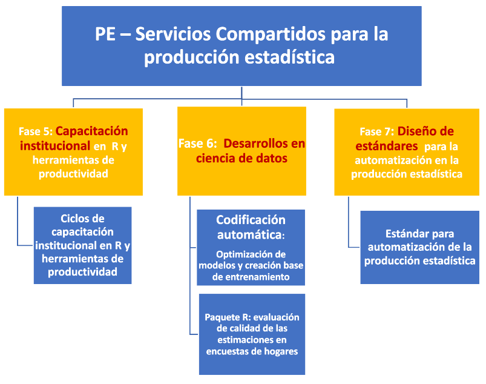

class: center, middle

.linea-superior[]
.linea-inferior[]


## Introducción a R

## Proyecto Estratégico Servicios Compartidos para la Producción Estadística

### Enero 2021

Ignacio Agloni y Klaus Lehmann

```{r setup, include=FALSE}
options(htmltools.dir.version = FALSE)
knitr::opts_chunk$set(message = FALSE) 
```

```{r xaringan-themer, include=FALSE, warning=FALSE}
library(xaringanthemer)
#style_duo_accent(
 # primary_color = "#1381B0",
  #secondary_color = "#FF961C",
  #inverse_header_color = "#FFFFFF"
#)
```


---
background-image: url("imagenes/fondo2.PNG")
background-size: contain;
background-position: 100% 0%

# Objetivos de la presentación

<br>
<br>

--

.center[
## Ofrecer contexto sobre la relevancia que ha cobrado `R` en la institución
]

<br/>

--

.center[
## Mostrar las principales funcionalidades de `R`
]

<br/>

--

.center[

## Entregar algunas herramientas prácticas para la resolución de requerimientos e instalación de algunos componentes
]

<br/>

---

background-image: url("imagenes/fondo2.PNG")
background-size: contain;
background-position: 100% 0%

# Contenidos de la presentación

--
<br/>

- Presentación general del .pur[Proyecto Estratégico Servicios Compartidos para la Producción Estadística]

--

- Descripción general del lenguaje

--

- Presentación del IDE

--

- Principales requerimientos del negocio

--

- Manejo de paquetes

--

- Miktex - Tinytex - Rtools

--

- Interacción con bases de datos

--

- Aplicaciones en html

--

- Interacción con otros lenguajes (python, SQL)

---
background-image: url("imagenes/fondo2.PNG")
background-size: contain;
background-position: 100% 0%

# PE Servicios Compartidos

--

<br/>
<br/>

.center[.medium-par[**Objetivo del proyecto**:]]

.center[.medium-par[Proveer a la institución de estándares y desarrollos que permitan .medium-par-red[automatizar], .medium-par-red[estandarizar], .medium-par-red[ordenar] e .medium-par-red[innovar] en la producción estadística, permitiendo reducir .medium-par-red[tiempos] y .medium-par-red[costos] del procesamiento y análisis de las diferentes operaciones estadísticas del INE y minimizando la probabilidad de .medium-par-red[errores] en la publicación de resultados.]]

---
background-image: url("imagenes/fondo2.PNG")
background-size: contain;
background-position: 100% 0%

# PE SSCC - Estructura del proyecto

--
.center[

]

---
background-image: url("imagenes/fondo2.PNG")
background-size: contain;
background-position: 100% 0%

# PE SSCC - Planificación 2020-2021

--
<br/>
<br/>

.center[

]

---
background-image: url("imagenes/fondo2.PNG")
background-size: contain;
background-position: 100% 0%

# R, Autimatización y Ciencia de datos

--
<br/>
<br/>

.center[
.medium-par[¿Alguna/o de ustedes tiene experiencia con `R`?]
]

<br/>

--

.center[
.medium-par[¿Manejan o conocen algún .pur[lenguaje de programación]?]
]

<br/>

--

.center[
.medium-par[¿Donde creen que debiera fijarse el .pur[límite] entre el rol del .pur[negocio] y la .pur[Mesa de servicios] en cuanto a la administración de R?]
]

--

.center[
.big-par[🤔]
]

---
background-image: url("imagenes/fondo2.PNG")
background-size: contain;
background-position: 100% 0%

# Panorama institucional

Durante los últimos años, las herramientas más comunmente utilizadas en la SDT han sido STATA y SAS.

.pull-left[


]

.pull-right[


]


--

Existe un impulso para que los procesamientos migren a `R`.

--

La competencia natural de `R` dentro de la institución es .pur[STATA].

--

- Ambos permiten llevar a cabo el procesamiento estadístico.

- Stata es muy popular entre de los economistas.

--

Pero...

--

- R es .pur[gratuito].

- Permite abordar una .pur[variedad de tareas] mucho más amplia que STATA.

---

background-image: url("imagenes/fondo2.PNG")
background-size: contain;
background-position: 100% 0%

# Panorama institucional


### Python podría ser una buena alternativa 

.center[

]


También es gratuito.


--

Es un lenguaje .pur[multiparadigma] que podría ser .pur[compartido por SDT y SDTI].

--

Pero su uso es aún muy incipiente en la SDT.  


---
background-image: url("imagenes/fondo2.PNG")
background-size: contain;
background-position: 100% 0%

# Descripción del lenguaje

`R` es un lenguaje de **libre distribución** y de **código abierto**, disponible para **Linux**, **Windows** y **MacOS**

.center[


]

--

Tanto R como RStudio (IDE) son gratuitos.

--

.pull-left[

]

.pull-right[


]

--

La primera versión de `R` fue liberada en 1993 y constantemente aparecen actualizaciones (**versión actual 4.0.3**). 

--

`R` es un .pur[lenguaje interpretado] de .pur[alto nivel], que utiliza por detrás código de C, C++ y Fortran.

---
background-image: url("imagenes/fondo2.PNG")
background-size: contain;
background-position: 100% 0%

# Descripción del lenguaje

--

`R` fue diseñado por estadísticos y para estadísticos.

--

Con el tiempo su uso se ha ido extendiendo a otras áreas: medicina, ciencia política, ingeniería, ciencias sociales, ecología, entre otros.

--

.center[


]


---

background-image: url("imagenes/fondo2.PNG")
background-size: contain;
background-position: 100% 0%

# Descripción del lenguaje

--

Actualmente, es un lenguaje muy popular en el mundo académico y está tomando fuerza en el sector público. 


.center[


]


--

### Compite con Python en el campo de la ciencia de datos.

---

background-image: url("imagenes/fondo2.PNG")
background-size: contain;
background-position: 100% 0%

# ¿Por qué transitar a R en la SDT?

--

Es muy útil en dos campos

- Automatización del procesamiento estadístico

- Tareas relacionadas con ciencia de datos

--

**Procesamiento**

- IDE muy eficiente y fácil de usar

--

- Integración sencilla con git

--

- Soluciones para tareas muy específicas (desarrollo de paquetes)

--

- Integración sencilla con otros lenguajes (python y SQL) 

--

- Automatización de reportes

--

- Manejo sencillo de distintos formatos de archivo (dta, sav, xlsx, csv, tab)

--

- Paralelización de procesos costosos


---

background-image: url("imagenes/fondo2.PNG")
background-size: contain;
background-position: 100% 0%

# ¿Por qué transitar a R en la SDT?

**Ciencia de datos**

- Procesamiento de texto e imágenes

--

- Machine learning 

--

- Incoporación rápida de avances estadísticos

--

- Muy buena visualización 

--

**También existen algunas desventajas**

- Requiere analistas con mayores habilidades de programación 

--

- Requiere establecer ciertos estándares

--

- No cuenta con las mejores librerías para *deep learning*

--

- No es un lenguaje multipropósito, como python o java.  

---
background-image: url("imagenes/fondo2.PNG")
background-size: contain;
background-position: 100% 0%

# RStudio

--

R puede funcionar con distintos IDEs (Eclipse, Visual Studio, R-Brain).

--

El más popular es `RStudio`

--

.center[


]

---
background-image: url("imagenes/fondo2.PNG")
background-size: contain;
background-position: 100% 0%

# Principales requerimientos del negocio

Compilamos algunos de los requerimientos que llegan a la Mesa de Servicios:

--

*Estimados/as, Junto con saludar, solicito me puedan instalar la **última actualización del software R**, puesto que intente descargar un paquete y no me dejo debido a que la versión que tengo no es la más actualizada.*

--

*Solicito de vuestra ayuda para actualizar software R y RStudio, además de **dejar habilitada la opción en mi equipo de que este software pueda descargar librerías y actualizaciones***

--

*El requerimiento se hace principalmente para actualizar el software R en sus últimas versiones:R 4.0.3 RStudio Desktop 1.3.1093 **Rtools 4.0 Miktex 20.10**. Finalmente tengo un requerimiento adicional, el software Miktex que brinda librerías adicionales en R no puede descargar librerías de sus servidores, al parecer la red INE no admite la descarga, ¿es posible permitir a este programa bajar librerías?*

--

*Hola! Necesito **permisos para ejecutar el software RStudio como administrador**, para poder instalar algunos paquetes que debo usar.*

---
background-image: url("imagenes/fondo2.PNG")
background-size: contain;
background-position: 100% 0%

# Principales requerimientos del negocio

--

*Estimados:Junto con saludar, como ustedes saben, en la institución habemos muchos funcionarios que ocupamos el software R. Desde hace unas semanas (meses) me percaté que desde mi equipo **no es posible conectarse a los repositorios CRAN** (ninguno, ni siquiera el repositorio alojado en la Univ de Chile) para actualizar/instalar paquetes en R. Probablemente, se modificaron las restricciones (...)* 

--

*(...) Varias unidades estamos a cargo de indicadores CDC que implican el uso de R para automatizar boletines regionales, por lo que es imprescindible tener actualizados los paquetes de R y de las **distribuciones de LATEX**. En este último caso, en Biobio Ocupamos **Tinitex** desde RStudio, y ocurre algo similar, no es posible conectarse a los repositorios CRAN. Adicionalmente, cuando tuve que ocupar Python a través de la IDE Anaconda, tampoco permitia conetctar a los repositorios. **El problema no ha reventado , dado que muchos se encuentran haciendo trabajo remoto desde sus computadores personales**, pero cuando se vuelva a usar en forma intensiva los equipos de oficina, se va a necesitar actualizar e instalar los paquetes que estamos ocupando , para que los códigos puedan ejecutarse.*

---
background-image: url("imagenes/fondo2.PNG")
background-size: contain;
background-position: 100% 0%

# Principales requerimientos del negocio

--

<br/>

.center[.medium-par[La mayoría de estos problemas podrían ser solucionados por los usuarios]]

--

<br/>

.center[.medium-par[El obstáculo radica en los permisos de administración]]

--

<br/>

.center[.medium-par[Revisaremos cómo dar solución a estos requerimientos]]

--

<br/>

.center[.big-par[🤓]]


---
background-image: url("imagenes/fondo2.PNG")
background-size: contain;
background-position: 100% 0%

# Paquetes (librerías) en R 

--
<br/>

La comunidad de R colabora activamente en el desarrollo de paquetes.

--

**CRAN** (*Comprehensive R Archive Network*) es el repositorio donde se almacenan los paquetes "oficiales".

--

Actualmente en CRAN hay .pur[más de 10.000 paquetes disponibles].

--

Entrar a CRAN requiere cumplir con ciertos estándares de calidad.

---
background-image: url("imagenes/fondo2.PNG")
background-size: contain;
background-position: 100% 0%

# Paquetes (librerías) en R

--

Muchos usuarios suben sus paquetes a github o gitlab.

.center[


]

--

Esta es una manera rápida y fácil de compartir un desarrollo.

--

Muchos paquetes de gran utilidad no están en CRAN.

--

**Acá tenemos un problema para el que .medium-par-red[aún] no tenemos solución**.

--

No es posible descargar paquetes de .pur[github] debido a un bloqueo institucional.

--

Están bloqueados todos los sitios con denominación "nube de almacenamiento".

--

.pull-left[
Esto impide, por ejemplo, descargar un [paquete](https://github.com/michael-cw/SurveySolutionsAPI) que el Banco Mundial ofrece para interactuar con la API de Survey Solutions.  
]

.pull-right[


]

---

background-image: url("imagenes/fondo2.PNG")
background-size: contain;
background-position: 100% 0%

# Plataformas git en procesamiento 

--
<br/>

En el marco del PE SSCC se está estudiando la .pur[implementación de plataformas git para el procesamiento y análisis de datos].

--

Esta es una iniciativa incipiente, por lo que se está evaluando a través de .pur[experiencias de uso].

--

La primera experiencia a evaluar es el uso de .pur[Gitlab] en la .pur[prueba piloto de la IX EPF].

--

El .pur[desafío] es imprimir estas .pur[herramientas] y .pur[flujos de trabajo colaborativo] en equipos .pur[no informáticos].

--

.center[.medium-par[`R` facilita la vinculación con plataformas git a través de su interfaz gráfica.]]
---

background-image: url("imagenes/fondo2.PNG")
background-size: contain;
background-position: 100% 0%

# Instalación de paquetes 

--

Paquetes que están en CRAN.

```{r, eval=FALSE}
install.packages("tidyverse")
```

--

```{r, eval=FALSE}
library(tidyverse)
```

--

👀: para esto .medium-par[**NO**] se requieren permisos de administrador.

--

Paquetes fuera de CRAN.

```{r, eval=FALSE}
library(devtools)
install_github("Klauslehmann/calidad")
```

[Ejemplo paquete en github](https://github.com/Klauslehmann/calidad)

--

👀: esto .medium-par[**NO**] se puede aún teniendo permisos de administrador.

---

background-image: url("imagenes/fondo2.PNG")
background-size: contain;
background-position: 100% 0%

# Instalación de paquetes 

--

Instalación de versiones anteriores de un paquete.

```{r, eval=FALSE}
devtools::install_version("ggplot2", version = "0.9.1", repos = "http://cran.us.r-project.org")

```

--

Para instalar paquetes precompilados.

```{r, eval=FALSE}
install.binaries("ggplot2")
```

---

background-image: url("imagenes/fondo2.PNG")
background-size: contain;
background-position: 100% 0%

# Miktex - Tinytex - Rtools

## Rtools:

--


Es un programa de librerías que complementa R. Se descarga e instala de forma independiente. **NO ES UN PAQUETE DE R**.

--

Muchas librerías importantes como `devtools` o `tidyverse` requieren tener una versión de Rtools compatible para funcionar.

--

[Aquí](https://rpubs.com/Earlien/guide-to-installing-R) les dejamos una guía de instalación que incluye complementos como Rtools.

--

<br/>

.center[.medium-par[Recomendamos instalar Rtools junto con R y RStudio cuando sea solicitado por algún usuario.]]

--

Usuarios Windows tarde o temprano necesitaran **Rtools** si no lo tienen.

---

background-image: url("imagenes/fondo2.PNG")
background-size: contain;
background-position: 100% 0%

# Miktex - Tinytex - Rtools

## Miktex

Es una versión completa de **Latex** para Windows, bastante pesada y de difícil instalación.

--

**TAMPOCO ES UN PAQUETE DE R**, sino un programa externo requerido para correr **Latex* en Windows.

--

.center[.medium-par[¿Para qué se necesita usar **latex** desde R?🤔]]

--

.center[Para generar **informes en PDF**, como los .pur[boletines automáticos]]

---

background-image: url("imagenes/fondo2.PNG")
background-size: contain;
background-position: 100% 0%

# Miktex - Tinytex - Rtools

## Tinytex

Es una versión de **Latex** ligera que ha hecho *Yihui Xie* para ser usada desde R.

--

Requiere tener instalado **Rtools**.

--

Este se puede instalar directamente desde RStudio.

```{r, eval = F}
# instalacion de TinyTeX
    install.packages('tinytex')
    tinytex::install_tinytex()
```

--

<br/>

.center[.medium-par[**Tinytex** permite prescindir de **Miktex** por lo que recomendamos la instalación del primero si solo se va a utilizar **Latex** desde `R`.]]

---

background-image: url("imagenes/fondo2.PNG")
background-size: contain;
background-position: 100% 0%

# R para bases de datos 

--

Existen varios paquetes para trabajar con bases de datos.

--

- `DBI`

- `RODBC`

- `dbConnect`

- `RSQLite`

- `RMySQL`

- `RPostgreSQL`

--

Para hacer la conexión, la opción más sencilla es autenticar mediante la cuenta institucional.

--

```{r, eval=FALSE}
con <- odbcDriverConnect('driver={SQL Server};server=BUVMSQLWINP01\\EXPLOT;database=ENE_ZERO;trusted_connection=true<encoding = latin1')
```


---
background-image: url("imagenes/fondo2.PNG")
background-size: contain;
background-position: 100% 0%

# R para bases de datos

--

Establecer la conexión desde una máquina Linux no permite autenticar con las credenciales institucionales.

--

Se genera un problema cuando queremos trabajar desde el RServer (CentOS).

--

En estos casos, accedemos mediante un usuario creado en la base de datos.

```{r, eval=FALSE}
library(RODBC)
con <- odbcDriverConnect('driver=ODBC Driver 11 for SQL Server;server=buvmsqlwinp04\\RRAA,58550;database=SUPERINTENDENCIA_2; uid=****; pwd=*******')

```

--

Podemos consultar la base de datos usando directamente código de SQL.


```{r, eval=FALSE}
query = sqlQuery(con, 'SELECT TOP 10 * FROM SUPERINTENDENCIA_2.dbo.COTIZACIONES_TRAB_A02') 
```

---

background-image: url("imagenes/fondo2.PNG")
background-size: contain;
background-position: 100% 0%

# R para bases de datos 

También es posible hacer consultas con código de `R`, mediante `dbplyr`.

--

```{r, eval=FALSE}
library(dbplyr)
con <- DBI::dbConnect(RSQLite::SQLite(), "driver=ODBC Driver 11 for SQL Server;server=buvmsqlwinp04\\RRAA,58550;database=SUPERINTENDENCIA_2; uid=****; pwd=*******")

copy_to(con, query, "query2")
query2 <- tbl(con, "query2")

media <- query2 %>% #<<
  group_by(anio) %>% #<< 
  summarise(media = mean(ID_trabajor, na.rm = TRUE)) %>% #<<
  select(media) #<<

media %>% 
  collect()


```

--

El paquete `dbplyr` traduce la sintaxis de `dplyr` a SQL.

--

.pull-left[

### ¿Qué es dplyr?


]


.pull-right[

]


---
background-image: url("imagenes/fondo2.PNG")
background-size: contain;
background-position: 100% 0

# Un poco sobre dplyr y tidyverse

--

Durante los últimos años ha surgido un proyecto llamado **tidyverse**.

--

Es un conjunto de paquetes que comparten **una filosofía, una sintaxis y una manera de hacer las cosas**.


.center[

]

---
background-image: url("imagenes/fondo2.PNG")
background-size: contain;
background-position: 100% 0

# Un poco sobre dplyr y tidyverse

--

Aunque no existe una única forma de hacer las cosas, es útil llegar a consensos, en aras de mejorar la comunicación.

--

`tidyverse` nos provee de una gran cantidad de herramientas para tener un lenguaje común.

--

Desde Servicios Compartidos estamos promoviendo el uso de tidyverse para el procesamiento estadístico.   


--

El paquete `dplyr` es el corazón de `tidyverse` y la principal herramienta para la manipulación de datos.


.pull-left[

]

.pull-right[
### dplyr es nuestro caballito de batalla en las capacitaciones

.red[👁️ tidyverse y por tanto dplyr requieren tener instalado rtools]
]


---
background-image: url("imagenes/fondo2.PNG")
background-size: contain;
background-position: 100% 0%

# R y webscraping

Las fuentes de información para las estadísticas oficiales se están diversificando

--

La información web se torna cada vez más relevante

--

R nos permite trabajar con datos web mediante algunos paquetes

- rvest

- RSelenium

- httr

--

RSelenium es una gran herramienta para interactuar con los navegadores

---

background-image: url("imagenes/fondo2.PNG")
background-size: contain;
background-position: 100% 0%

# R y webscraping

```{r, eval=F, message=F}
library(RSelenium); library(wdman);library(tidyverse)
version <- binman::list_versions("chromedriver")

rD1 <- rsDriver(browser = "chrome", port = 4567L, geckover = NULL, #4567
                chromever = version[[1]][2], iedrver = NULL, phantomver = NULL)
remDr <- rD1[["client"]]

remDr$navigate("https://www.jumbo.cl")
remDr$maxWindowSize(winHand = "current")

webelem_cat_super <- remDr$findElements(using = 'css selector', ".new-header-supermarket-button")
remDr$mouseMoveToLocation(webElement = webelem_cat_super[[1]])

webelem_nodo_generico <- remDr$findElements(using = 'css selector', ".new-header-supermarket-dropdown-item-name")
remDr$mouseMoveToLocation(webElement = webelem_nodo_generico[[2]])

webelem_nodo_generico[[2]]$click()

precios <- remDr$findElements(using = "css selector", ".product-single-price-container")
map_chr(precios,   ~.x$getElementText()[[1]]) 


```


---
background-image: url("imagenes/fondo2.PNG")
background-size: contain;
background-position: 100% 0%

# R y html

--

Existen múltiples herramientas para generar archivos html.

--

Esta presentación es un archivo html generado con un paquete llamado `rmarkdown`.

--

```{html, eval = F}
<script>
slideshow._releaseMath = function(el) {
  var i, text, code, codes = el.getElementsByTagName('code');
  for (i = 0; i < codes.length;) {
    code = codes[i];
    if (code.parentNode.tagName !== 'PRE' && code.childElementCount === 0) {
      text = code.textContent;
      if (/^\\\((.|\s)+\\\)$/.test(text) || /^\\\[(.|\s)+\\\]$/.test(text) ||
          /^\$\$(.|\s)+\$\$$/.test(text) ||
          /^\\begin\{([^}]+)\}(.|\s)+\\end\{[^}]+\}$/.test(text)) {
        code.outerHTML = code.innerHTML;  // remove <code></code>
        continue;
      }
    }
    i++;
  }
};
slideshow._releaseMath(document);
</script>

```

---
background-image: url("imagenes/fondo2.PNG")
background-size: contain;
background-position: 100% 0%

# rmarkdown 

--
<br/>

Es un paquete que está siendo utilizado de manera intensiva en la SDT para generar reportes 

--

Permite generar archivos html y pdf

--

La modalidad pdf soporta código de latex.

--

Dado que `rmarkdown` permite incluir texto plano y código en R, es ideal para incorporar sistemas automáticos de reportería.

--

[Documento de trabajo](https://www.ine.cl/docs/default-source/documentos-de-trabajo/c%C3%A1lculo-de-medidas-de-precisi%C3%B3n-para-medianas-de-ingreso-y-gasto-de-la-v.pdf?sfvrsn=e5b6a7b3_2) en pdf generado con `rmarkdown`.

--

Para la generación de reportes automáticos que se han multiplicado ultimamente se está utilizando `rmarkdown` en combinación con un paquete llamado `Sweave`.

--

Se han automatizado en el INE con estas herramientas el **EMAT**, **ISUP**, **IPP**, entre otros, y se está trabajando en la automatización de los boletines de la **ENE**.

--

Se ha generado un ahorro importante de tiempo de trabajo manual.

---
background-image: url("imagenes/fondo2.PNG")
background-size: contain;
background-position: 100% 0%

# R y html 

bookdown es otro paquete para generar archivos html

--

El objetivo es generar un libro en formato digital

--

[R for data science](https://r4ds.had.co.nz/) 

--

El manual de trabajo de campo de la prueba piloto EPF fue generado mediante bookdown


---
background-image: url("imagenes/fondo2.PNG")
background-size: contain;
background-position: 100% 0%

# R y shiny 

--

`shiny` permite crear aplicaciones web mediante código de R

--

El paquete permite generar un archivo html que contiene javascript y css. 

--

Se estructura a partir de 2 funciones principales:

- ui: interfaz de usuario 

- server: procesa los datos 


[Ejemplo EPF](https://klaus-lehmann.shinyapps.io/epf-app/?_ga=2.227155677.1937938277.1605228598-1258237829.1596836306)

---

background-image: url("imagenes/fondo2.PNG")
background-size: contain;
background-position: 100% 0%


# Visualizaciones con R 

--

Es posible generar visualizaciones animadas

--

```{r, echo=F, fig.align='center', warning=F, message=F}
library(gganimate)
p <- ggplot(gapminder::gapminder, aes(gdpPercap, lifeExp, 
                           color = continent)) +
  geom_point(aes(size = pop), show.legend = FALSE) +
  scale_y_continuous(breaks = seq(20,90,10)) +
  scale_size(range = c(2,12)) + 
  scale_x_log10() +
  transition_states(year) + #<< 
  labs(title = 'Año: {closest_state}', x = 'pib p/c', y = 'esperanza de vida') + #<<
  theme(plot.title = element_text(hjust = 0.5))

animate(p, renderer = gifski_renderer(), fps=10)


```

---

background-image: url("imagenes/fondo2.PNG")
background-size: contain;
background-position: 100% 0%

# Visualizaciones con R 

--

Podemos usar de manera sencilla código de javascript para generar visualizaciones más atractivas 

[Ejemplo EPF](https://klauslehmann.netlify.app/2019/07/07/en-qu%C3%A9-gastan-los-hogares-chilenos/) 

--

`R` está acercando herramientas de visualización a los analistas técnicos, permitiéndoles .pur[desarrollar sus propias visualizaciones sin necesidad de edición para llegar al usuario final].

--

Actualmente existe una **mesa de trabajo entre SDT y SDTI (difusión)** para lograr embeber/implementar visualizaciones en la web institucional.

---

background-image: url("imagenes/fondo2.PNG")
background-size: contain;
background-position: 100% 0%

# Integración con otros lenguajes

Ya hemos visto que podemos usar código de SQL sin mayores problemas

--

Mediante el paquete `reticulate` es posible cargar el intérprete de python y generar flujos de trabajo integrados de python y R


.center[]

--

En Servicios Compartidos estamos incorporando un flujo de procesamiento que contiene código de python y R

---

background-image: url("imagenes/fondo2.PNG")
background-size: contain;
background-position: 100% 0%

# Integración con otros lenguajes

El paquete `Rcpp` permite usar código de C++

```{r, eval=FALSE}
library(Rcpp)
cppFunction('int add(int x, int y, int z) {
  int sum = x + y + z;
  return sum;
}')

add(1, 2, 3)

```


--

Podemos usar C++, para crear funciones de R más eficientes 

--

Última alternativa cuando las funciones existentes no son suficientemente veloces

---

background-image: url("imagenes/fondo2.PNG")
background-size: contain;
background-position: 100% 0%


# Revisando el hardware

--

R También permite conocer los recursos disponibles en la máquina mediante funciones.

--

Para mirar el número de CPUs.

```{r}
library(parallel)
detectCores()

```

--

Para mirar la versión de R

```{r}
version
```

---

background-image: url("imagenes/fondo2.PNG")
background-size: contain;
background-position: 100% 0%

# Para finalizar

--

Como pueden ver, el potencial de `R` es amplio, y es muy probable que profundice su uso en nuevas tareas.

--

.center[.medium-par[Por eso es muy importante la coordinación entre el **negocio** y el **soporte**]⚙️]

--

.center[.medium-par[Como proyecto Servicios Compartidos estamos disponibles para atender sus consultas.]]

--

Ya tienen nuestros correos: 

    - ignacio.agloni@ine.cl
    - klaus.lehmannm@ine.cl

--

.center[.medium-par[Muchas gracias!!😎]]

---

class: center, middle

.linea-superior[]
.linea-inferior[]


## Introducción a R

## Proyecto Estratégico Servicios Compartidos para la Producción Estadística

### Enero 2021
